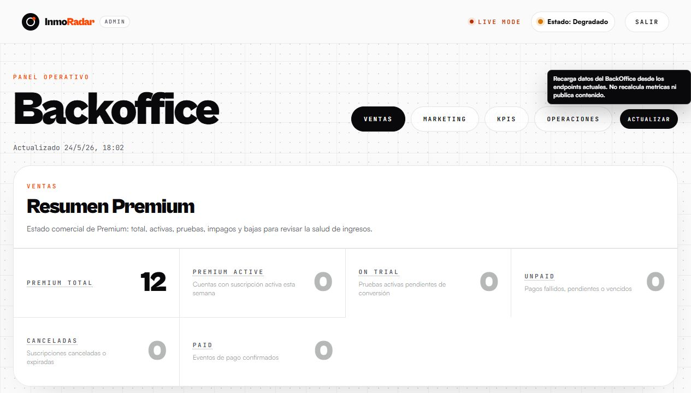
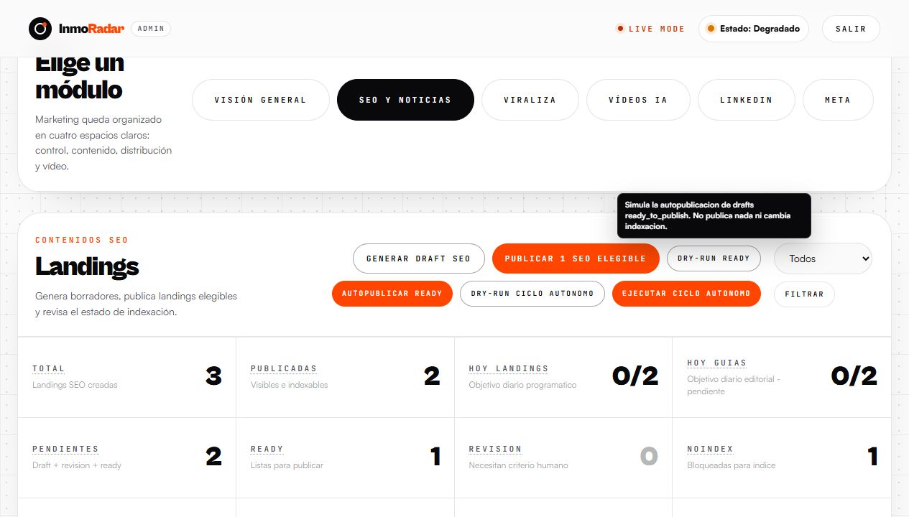
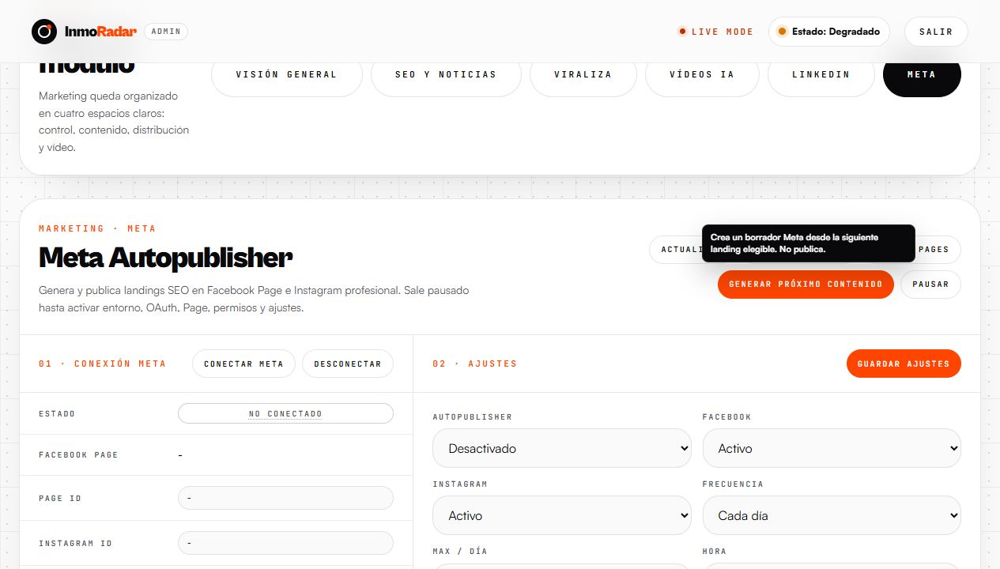
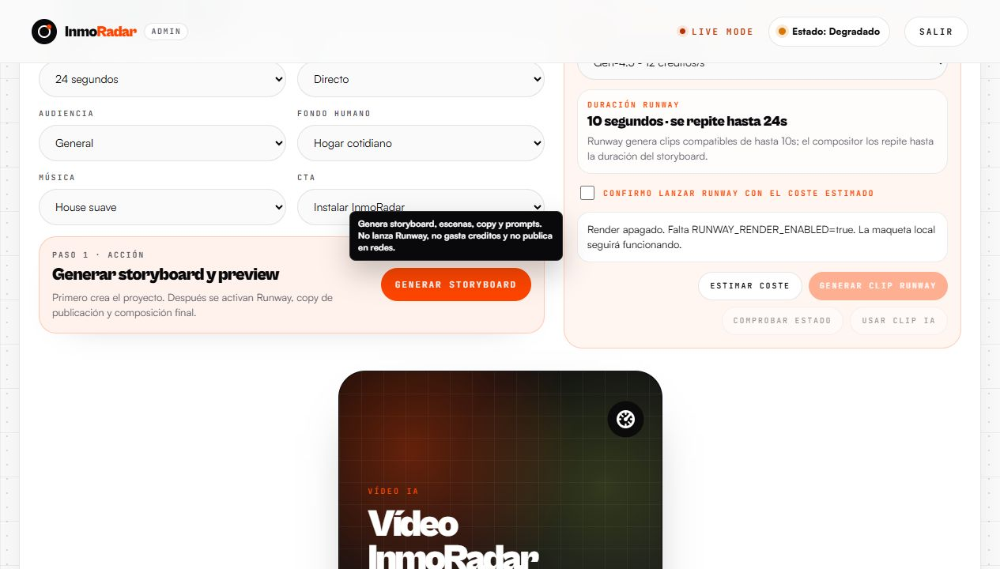
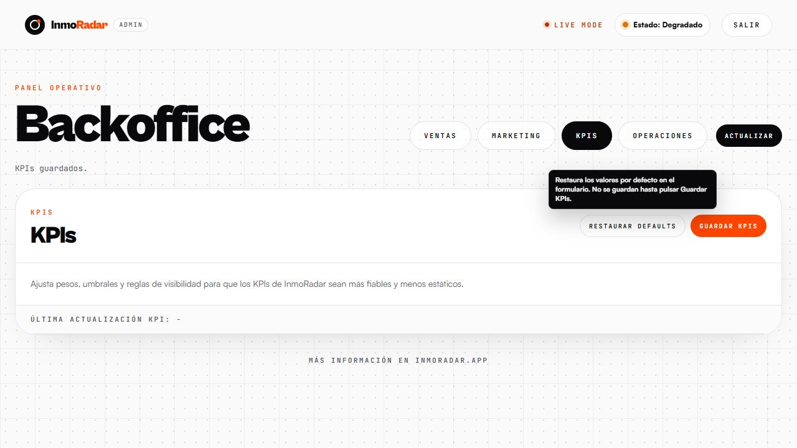
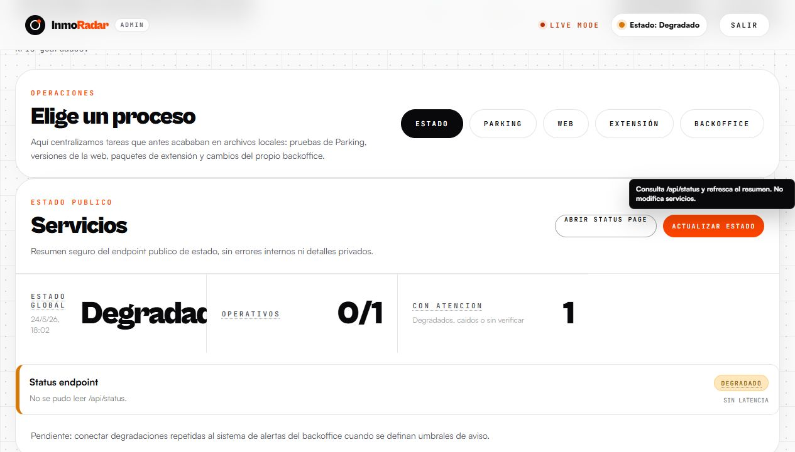

# BackOffice tooltips visual QA

Fecha: 2026-05-24
Rama: `codex/backoffice-tooltips-visual-qa`

## Objetivo

Auditar visualmente que la ayuda contextual del BackOffice es legible, aparece en acciones relevantes y evita ambiguedades en KPIs, botones, dry-runs y selectores importantes.

## Metodo

- BackOffice servido en local con datos de QA y token local.
- Capturas de escritorio con tooltip abierto sobre una accion representativa.
- Verificacion adicional de selectores: Premium `status` y Video `series_id` reciben ayuda contextual generica por formulario.
- Sin cambios de endpoints, metricas ni handlers de publicacion.

## Capturas

### Ventas / Premium

Resultado: el boton Actualizar explica que recarga datos y que no recalcula metricas ni publica contenido.

### Marketing / SEO

Resultado: el dry-run explica que simula autopublicacion de drafts `ready_to_publish` y que no publica ni cambia indexacion.

### Marketing / Meta

Resultado: la accion visible de generar proximo contenido aclara que crea borrador y no publica. La accion `Publicar ahora` queda cubierta por `data-help-key="meta-publish-now"` y test, aunque en QA visual aparece oculta si no hay post seleccionado.

### Marketing / Videos IA

Resultado: el boton Generar storyboard ahora aclara que prepara escenas, copy y prompts, pero no lanza Runway, no gasta creditos y no publica.

### KPIs

Resultado: el reset de KPIs aclara que restaura valores en formulario y que no guarda hasta pulsar Guardar KPIs.

### Operaciones / Status

Resultado: el refresco de estado aclara que consulta `/api/status` y no modifica servicios.

## Hallazgos corregidos

- `Generar storyboard` no tenia ayuda contextual propia. Se anadio `data-help-key="video-generate"`.
- Los selectores importantes dependian de claves manuales. Se anadio ayuda contextual generica para `select`, fechas y busquedas segun el formulario.
- Algunas acciones dinamicas de Viraliza quedaban cubiertas solo por fallback textual. Se anadio ayuda especifica para plan diario, registrar resultado, crear video desde hook e ideas desde videos guardados.

## Riesgos pendientes

- La captura de Operaciones usa servidor de QA local; el estado degradado mostrado no es una senal de produccion.
- Falta una pasada visual movil dedicada. La capa ya soporta toque, pero esta rama solo guarda capturas desktop.
- En Meta, la captura de `Publicar ahora` requiere datos de cola visibles; queda cubierto por codigo y test, no por captura.
